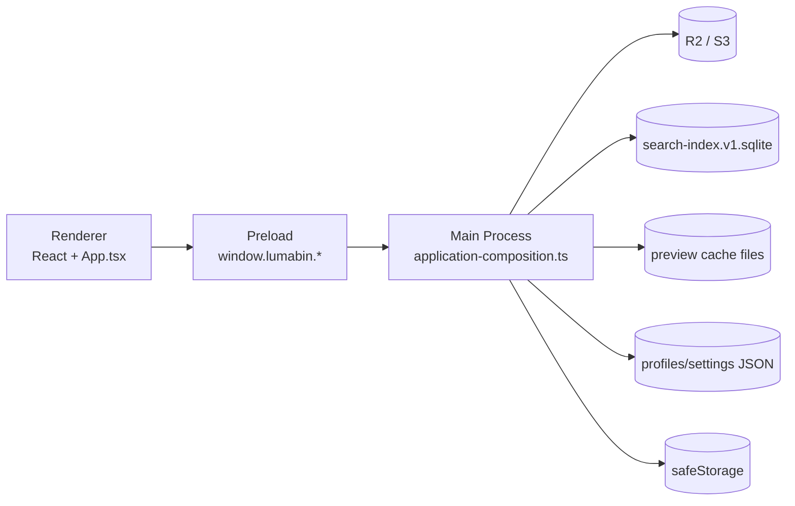

# LumaBin アーキテクチャ

- 最終更新日: 2026-05-04
- ステータス: Active（MVP実装済み / Beta hardening反映）
- 参照: [SPEC.md](SPEC.md), [RUNBOOK.md](RUNBOOK.md)

## 1. 目的

本ドキュメントは、**現在の実装実態**を基準に LumaBin の構成と責務分割を示す。
理想案ではなく、`apps/desktop` のコードと一致する内容を記載する。

## 2. システム構成（現行）



補足:
- Utility Process は **未分離**。現在は Main Process 内でストレージ処理を実行している。
- Renderer は直接 AWS SDK を使わず、Preload 経由でのみ I/O を行う。

## 3. ディレクトリ構成（現行）

```text
apps/desktop/src/
├── main.ts
├── preload.ts
├── renderer.tsx
├── App.tsx
├── index.css
├── features/
│   ├── gallery/
│   │   ├── action-modals.tsx
│   │   ├── active-query-summary.tsx
│   │   ├── asset-action-dialog.tsx
│   │   ├── asset-list-pane.tsx
│   │   ├── bulk-action-dialogs.tsx
│   │   ├── delete-undo-toast.tsx
│   │   ├── empty-browser-state.tsx
│   │   ├── gallery-layout-policy.ts
│   │   ├── gallery-thumbnail-policy.ts
│   │   ├── filter-bars.tsx
│   │   ├── gallery-filter-options.ts
│   │   ├── gallery-view-model-calculations.ts
│   │   ├── gallery-virtualization-calculations.ts
│   │   ├── gallery-pane.tsx
│   │   ├── gallery-top-row.tsx
│   │   ├── selection-action-bar.tsx
│   │   ├── upload-conflict-dialog.tsx
│   │   ├── recent-views-state.ts
│   │   ├── saved-view-state.ts
│   │   ├── use-persisted-ui-state.ts
│   │   ├── use-recent-views-state.ts
│   │   ├── use-asset-focus-controller.ts
│   │   ├── use-asset-browser-query-controller.ts
│   │   ├── use-gallery-thumbnails.ts
│   │   ├── use-gallery-view-model.ts
│   │   ├── use-gallery-workspace-preferences.ts
│   │   ├── use-gallery-dialog-guards.ts
│   │   ├── use-gallery-scroll-controller.ts
│   │   ├── use-gallery-selection-controller.ts
│   │   ├── use-gallery-scroll-effects.ts
│   │   ├── use-selected-profile-gallery-bootstrap.ts
│   │   ├── use-pending-delete-controller.ts
│   │   ├── use-pending-delete-toast-summary.ts
│   │   ├── use-asset-mutation-commands.ts
│   │   └── use-saved-view-commands.ts
│   ├── layout/
│   │   ├── app-topbar.tsx
│   │   ├── global-keyboard-shortcuts-policy.ts
│   │   ├── profile-select.tsx
│   │   ├── use-workspace-document-effects.ts
│   │   ├── use-tooltip-warm-state.ts
│   │   ├── use-transient-feedback.ts
│   │   ├── use-unsaved-changes-before-unload.ts
│   │   ├── use-workspace-bootstrap.ts
│   │   ├── use-workspace-modal-guards.ts
│   │   ├── workspace-feedback-layer.tsx
│   │   └── status-strip.tsx
│   ├── onboarding/
│   │   └── guided-start.tsx
│   ├── preview/
│   │   ├── quick-preview-animation-policy.ts
│   │   ├── quick-preview-action-button.tsx
│   │   ├── quick-preview-info-panel.tsx
│   │   ├── quick-preview-media-panel.tsx
│   │   ├── quick-preview-metadata-labels.ts
│   │   ├── quick-preview-modal-contracts.ts
│   │   ├── quick-preview-modal.tsx
│   │   ├── quick-preview-sharing-section.tsx
│   │   ├── quick-preview-technical-details.tsx
│   │   ├── quick-preview-topbar.tsx
│   │   ├── use-asset-preview-controller.ts
│   │   ├── use-quick-preview-close-animation.ts
│   │   ├── use-quick-preview-modal-commands.ts
│   │   ├── use-quick-preview-focus-restore.ts
│   │   ├── use-quick-preview-lifecycle.ts
│   │   ├── use-quick-preview-navigation.ts
│   │   └── use-preview-sharing-commands.ts
│   ├── settings/
│   │   ├── connection-setup-modal.tsx
│   │   ├── dev-metrics-panel.tsx
│   │   ├── profile-form-state.ts
│   │   ├── shortcut-help-modal.tsx
│   │   ├── use-connection-setup-effects.ts
│   │   ├── use-dev-metrics-commands.ts
│   │   ├── use-dev-metrics-polling.ts
│   │   ├── use-legacy-public-base-url-migration.ts
│   │   ├── use-profile-menu-effects.ts
│   │   ├── use-profile-commands.ts
│   │   ├── workspace-browser-session-panel.tsx
│   │   ├── workspace-connection-panel.tsx
│   │   ├── workspace-defaults-panel.tsx
│   │   ├── workspace-saved-views-panel.tsx
│   │   ├── workspace-settings-footer.tsx
│   │   ├── workspace-settings-state.ts
│   │   └── workspace-settings-modal.tsx
│   ├── shared/
│   │   ├── asset-key.ts
│   │   ├── asset-display.ts
│   │   ├── asset-prefix.ts
│   │   ├── format-count.ts
│   │   ├── media-preview.ts
│   │   └── profile-menu-option.ts
│   ├── upload/
│       ├── upload-candidates.ts
│       ├── upload-failure-message.ts
│       ├── upload-input-events.ts
│       ├── upload-queue-persistence.ts
│       ├── upload-source-resolution.ts
│       ├── upload-status-toast.tsx
│       ├── use-upload-candidate-upload.ts
│       ├── use-upload-completion-refresh.ts
│       ├── use-upload-controller.ts
│       ├── use-upload-drop-zone.ts
│       ├── use-upload-file-picker.ts
│       ├── use-upload-job-polling.ts
│       ├── use-upload-paste.ts
│       ├── use-upload-queue-commands.ts
│       ├── use-upload-queue-persistence.ts
│       ├── use-upload-toast-stack-height.ts
│       └── use-upload-toast-lifecycle.ts
│   └── workbench/
│       ├── desktop-workbench-center-pane-coordination.ts
│       ├── desktop-workbench-main-presenters.ts
│       ├── desktop-workbench-overlay-coordination.ts
│       ├── desktop-workbench-overlays.ts
│       ├── desktop-workbench-shell-inputs.ts
│       ├── desktop-workbench-topbar-coordination.ts
│       ├── use-asset-actions-workbench.ts
│       ├── use-desktop-workbench-feedback.ts
│       ├── use-desktop-workbench.ts
│       ├── use-desktop-workbench-shell.ts
│       ├── use-desktop-workbench-shell-coordination.ts
│       ├── use-desktop-workbench-shell-resources.ts
│       ├── use-diagnostics-workbench.ts
│       ├── use-gallery-browsing-workbench.ts
│       ├── use-gallery-session-workbench.ts
│       ├── use-gallery-settings-workbench.ts
│       ├── use-preview-workbench.ts
│       ├── use-upload-workbench.ts
│       ├── use-workspace-commands-workbench.ts
│       ├── use-workspace-gallery-lifecycle-workbench.ts
│       ├── use-workspace-runtime-state-workbench.ts
│       ├── use-workspace-settings-workbench.ts
│       └── use-workspace-state-workbench.ts
├── shared/
│   └── ipc.ts
└── main/
    ├── application/
    │   ├── bootstrap-composition.ts
    │   ├── composition-helpers.ts
    │   ├── contexts/
    │   │   ├── asset-discovery/
    │   │   │   ├── application-service.ts
    │   │   │   ├── composition.ts
    │   │   │   ├── ipc-handlers.ts
    │   │   │   ├── events.ts
    │   │   │   ├── index-bootstrapper.ts
    │   │   │   ├── ipc-contract.ts
    │   │   │   ├── search-read-model-policy.ts
    │   │   │   └── runtime-composition.ts
    │   │   ├── asset-ingestion/
    │   │   │   ├── application-service.ts
    │   │   │   ├── composition.ts
    │   │   │   ├── ipc-handlers.ts
    │   │   │   ├── events.ts
    │   │   │   ├── ipc-contract.ts
    │   │   │   └── runtime-composition.ts
    │   │   ├── asset-library/
    │   │   │   ├── command-service.ts
    │   │   │   ├── composition.ts
    │   │   │   ├── ipc-handlers.ts
    │   │   │   ├── events.ts
    │   │   │   ├── ipc-contract.ts
    │   │   │   ├── projection-invalidation-service.ts
    │   │   │   ├── projection-runtime-composition.ts
    │   │   │   ├── projection-subscribers.ts
    │   │   │   ├── query-runtime-composition.ts
    │   │   │   ├── runtime-composition.ts
    │   │   │   └── query-service.ts
    │   │   ├── asset-sharing/
    │   │   │   ├── query-service.ts
    │   │   │   ├── composition.ts
    │   │   │   ├── ipc-handlers.ts
    │   │   │   ├── ipc-contract.ts
    │   │   │   └── runtime-composition.ts
    │   │   ├── diagnostics/
    │   │   │   ├── ipc-handlers.ts
    │   │   │   └── ipc-contract.ts
    │   │   └── workspace/
    │   │       ├── application-service.ts
    │   │       ├── composition.ts
    │   │       ├── connection-service.ts
    │   │       ├── ipc-handlers.ts
    │   │       ├── events.ts
    │   │       ├── ipc-contract.ts
    │   │       └── runtime-composition.ts
    │   ├── events/
    │   │   ├── event-bus.ts
    │   │   └── event-types.ts
    │   ├── ipc/
    │   │   ├── contract-catalog.ts
    │   │   └── contract-types.ts
    │   └── read-models/
    │       └── asset-search-read-model.ts
    ├── adapters/
    │   ├── e2e-fixture-storage-adapter.ts
    │   ├── storage/
    │   │   ├── s3-client-factory.ts
    │   │   ├── s3-errors.ts
    │   │   ├── s3-retry.ts
    │   │   ├── storage-contracts.ts
    │   │   ├── storage-mutation-adapter.ts
    │   │   ├── storage-object-mappers.ts
    │   │   ├── storage-object-policy.ts
    │   │   ├── storage-presign-adapter.ts
    │   │   └── storage-query-adapter.ts
    │   ├── storage-upload-runner-adapter.ts
    │   └── upload-planning-adapter.ts
    ├── __integration__/
    │   └── storage-client.smoke.ts
    ├── application-bootstrap.ts
    ├── application-policies.ts
    ├── application-composition.ts
    ├── storage-client.ts
    ├── clipboard-upload-adapter.ts
    ├── profile-secret-store.ts
    ├── persistent-state.ts
    ├── repositories/
    │   ├── asset-projection-cache-repository.ts
    │   ├── saved-view-repository.ts
    │   ├── sqlite-asset-search-read-model-repository.ts
    │   ├── upload-job-repository.ts
    │   └── workspace-repository.ts
    ├── search-index.ts
    ├── asset-cache.ts
    ├── image-optimize.ts
    └── dev-metrics.ts
```

## 4. プロセス責務

### 4.1 Renderer

- 画面描画（Gallery/List/Preview）
- UI state（選択、フィルタ、スクロール位置、モーダル）
- DnD 入力受付
- localStorage 永続化（UI state / upload queue / recent views）
- Preload API は renderer composition root で `desktop-api-gateway` に集約し、bounded context 名で feature controller へ渡す
- `App.tsx` はレンダリング shell として扱い、横断 orchestration は `features/workbench/use-desktop-workbench.ts` に集約する。bounded context 固有の state / effect / command は `features/workbench/use-*-workbench.ts` へ寄せ、root workbench は context 間の最小 handoff に留める

### 4.2 Preload

- `window.lumabin.*` の IPC ブリッジを提供
- Renderer への公開 API を限定
- `webUtils.getPathForFile` を使ったファイルパス解決
- E2E 判定などの runtime 情報は Main Process の diagnostics query から取得し、Preload 側の環境変数推測に依存しない

### 4.3 Main Process

- IPC ハンドリング
- プロファイル・設定の永続化
- シークレット暗号化（safeStorage）
- R2/S3 接続・一覧・アップロード・削除・rename/move（runtime composition は `adapters/storage` を直接注入し、`storage-client.ts` は互換 facade として維持）
- presigned URL 発行
- preview 生成とディスクキャッシュ
- search read model（SQLite repository）更新/検索
- 開発用メトリクス収集
- upload abort 制御（job単位 AbortController）

Main Process の application service は repository / adapter の具体実装を直接参照せず、`runtime-composition.ts` で port に注入する。検索 read model は `AssetSearchReadModelReader` / `AssetSearchReadModelWriter` を application 境界の契約とし、SQLite 実装は repository module に閉じる。

## 4.4 Bounded Context と CQRS 境界

現時点ではプロセス分離や永続フォーマット変更は行わず、IPC契約を境界として Bounded Context / Command / Query を明示する。
分類は `application/contexts/<context>/ipc-contract.ts` を context ごとの一次情報とし、`application/ipc/contract-catalog.ts` が集約する。`registerApplicationComposition()` 起動時に IPC channel の分類漏れを検出する。

| Bounded Context | 責務 | Command | Query |
| --- | --- | --- | --- |
| `workspace` | profile / settings / secret参照 | profile保存・削除、settings保存 | profile一覧、接続テスト、settings取得 |
| `asset-library` | R2/S3上の asset そのもの | rename / move / delete | list / head / preview |
| `asset-ingestion` | ローカル入力と upload job | clipboard永続化、upload開始、cancel | conflict確認、upload job取得 |
| `asset-discovery` | search index / saved views | Saved View保存・削除 | search query、Saved View一覧 |
| `asset-sharing` | 一時URL生成 / public URL導線 | なし（現時点） | presigned GET / PUT URL生成 |
| `diagnostics` | 開発・運用メトリクス / runtime capability | metrics reset | metrics snapshot取得、runtime情報取得 |

### 方針

- Renderer から見える公開契約は `shared/ipc.ts` を維持する。
- Main 側の IPC 登録は `application/contexts/<context>/ipc-handlers.ts` に分割する。`workspace` / `asset-ingestion` / `asset-discovery` は Application Service、`asset-library` は Command Service / Query Service / projection subscriber、`asset-sharing` は Query Service を抽出済み。workspace 接続テストは `connection-service.ts` で endpoint reachability と storage check の依存を注入し、workspace / asset library / asset sharing runtime wiring は各 `runtime-composition.ts` に集約する。asset-sharing の presign URL 生成は Query Service から strategy port として呼び出し、E2E fixture / 通常 storage の切替は runtime composition が担当する。search index bootstrap は `index-bootstrapper.ts` で storage list と read model upsert の依存を注入する。profile / object mutation に伴う local projection invalidation は `projection-invalidation-service.ts` へ分離する。clipboard 一時ファイル保存、upload planning、E2E fixture storage、通常アップロード runner は infrastructure adapter、workspace state / Saved View / upload job state / local projection cache は repository として分離済みで、`application-composition.ts` は context 間の最小 orchestration を保持する。
- 書き込み系の副作用は command handler に閉じ、読み取り系は query/read model として扱う。
- search index / preview cache / upload job は local projection として扱い、R2/S3 の object metadata を正とする。

## 4.5 Event-Driven Architecture 境界

`application/events/event-bus.ts` はプロセス内イベントバスであり、配送と購読だけを担当する。イベント契約は `application/contexts/<context>/events.ts` を context ごとの一次情報とし、`application/events/event-types.ts` が union として集約する。現時点では外部配送・永続イベントストアは持たず、Main Process 内の副作用連携を段階的に分離するための境界として使う。購読を開始する runtime composition は dispose を返し、アプリケーション終了時に subscription を解放できる形にする。

`asset-library` の object mutation 後に必要な local projection 更新（head/search snapshot cache invalidation と search index rename/remove）は `projection-subscribers.ts` が購読して実行する。command handler は storage mutation と event 発行に寄せ、read model 更新は購読側へ移す。一覧取得や通常 upload 完了で観測した asset も `asset-library.assets.observed` として発行し、search read model upsert と search snapshot invalidation は projection subscriber 側で処理する。

Upload job repository は状態ストアとして扱い、status transition の差分だけを callback で runtime composition へ通知する。`asset-ingestion.upload-job.status-changed` の生成と publish は `asset-ingestion` runtime composition が担当する。

現在発行する主なイベント:

- `workspace.profile.saved`
- `workspace.profile.deleted`
- `workspace.settings.saved`
- `asset-ingestion.upload-job.status-changed`
- `asset-library.asset.renamed`
- `asset-library.asset.moved`
- `asset-library.assets.deleted`
- `asset-library.assets.observed`
- `asset-discovery.saved-view.saved`
- `asset-discovery.saved-view.deleted`

注意:
- signed URL / secret / raw credential はイベントpayloadに含めない。
- イベントは「後続の projection 更新や通知を購読へ逃がす」ための内部境界であり、現時点ではユーザー向け監査ログではない。

## 5. 永続化データと真実源

### 5.1 Main 側

- プロファイル/設定: JSON（atomic write）
- シークレット: safeStorage で暗号化
- 検索インデックス: `search-index.v1.sqlite`
- preview キャッシュ: userData 配下のファイルキャッシュ
  - max total: 256MB
  - max entry: 24MB
  - max files: 1,200（trim target 900）
  - max age: 7日

### 5.2 Renderer 側

- UI state: `lumabin.uiState.v1`
- upload queue: `lumabin.uploadQueue.v1`
- recent views: `lumabin.recentViews.v1`

### 5.3 データ方針

- R2/S3 を正とする: `key`, `size`, `lastModified`, `etag`, `contentType`
- ローカルを正とする: Saved Views, Smart Collections 状態, 閲覧履歴, UI state

## 6. 主要フロー

### 6.1 一覧取得

1. Renderer → `assets.list`
2. Main が `ListObjectsV2` 実行
3. 結果を Renderer へ返却
4. `asset-library.assets.observed` を発行し、subscriber が search read model を upsert

### 6.2 検索

1. Renderer → `search.query`
2. Main は SQLite インデックスを優先
3. 必要時のみ R2 一覧で補完

### 6.3 プレビュー

1. Renderer → `assets.preview`
2. Main が range 読み込み + 形式判定
3. 成功時はディスクキャッシュ
4. Renderer 側は request-id ガードで競合応答を破棄
5. cache write 失敗時は fail-open で preview を返す

### 6.4 アップロード

1. Renderer が DnD / file picker から `UploadSource[]` を作成
2. `assets.checkUploadConflicts` で競合確認
3. `assets.upload` 実行（小: PutObject, 大: multipart）
4. queue を定期ポーリングして UI 更新
5. 完了時に一覧自動リロード
6. cancel 時は進行中リクエストへ abort を伝播

### 6.5 削除

1. Renderer で delete を受け付け
2. 5 秒 Undo 窓を表示
3. 窓経過後に Main で `DeleteObjects` 実行

## 7. セキュリティ境界

- secret は Renderer へ返さない
- BrowserWindow は `contextIsolation: true`, `sandbox: true`, `nodeIntegration: false`
- signed URL / secret をログ出力しない
- destructive 操作は確認または Undo 窓を必須化

## 8. ビルドとCI

- Forge + Vite 構成
- main bundle では `sharp` と `node:*` を external 化
- CI: `.github/workflows/desktop-ci.yml`
  - `quality`: lint/typecheck/integration-smoke/audit
  - `package-smoke`: macOS package

## 9. 現在の技術的負債

- `App.tsx` は render shell 化済み。残る大きな責務は `features/workbench/use-desktop-workbench.ts` の renderer application orchestration に集中している。Preview / Sharing orchestration は `features/workbench/use-preview-workbench.ts`、Upload / Ingestion orchestration は `features/workbench/use-upload-workbench.ts`、Asset Library action orchestration は `features/workbench/use-asset-actions-workbench.ts`、Diagnostics orchestration は `features/workbench/use-diagnostics-workbench.ts`、Workspace state/read model は `features/workbench/use-workspace-state-workbench.ts`、Workspace command/effect orchestration は `features/workbench/use-workspace-commands-workbench.ts`、Workspace settings presenter orchestration は `features/workbench/use-workspace-settings-workbench.ts`、Gallery browsing orchestration は `features/workbench/use-gallery-browsing-workbench.ts`、Gallery settings handoff は `features/workbench/use-gallery-settings-workbench.ts`、Gallery session orchestration は `features/workbench/use-gallery-session-workbench.ts`、Overlay presenter assembly は `features/workbench/desktop-workbench-overlays.ts`、topbar/center pane presenter input assembly と表示 policy default は `features/workbench/desktop-workbench-main-presenters.ts`、workspace modal guard / keyboard / dialog / ui derivation の shell input handoff は `features/workbench/desktop-workbench-shell-inputs.ts`、keyboard/dialog shell wiring と shell derived UI read model は `features/workbench/use-desktop-workbench-shell.ts` へ分離済み。Shell input handoff はさらに keyboard search / selection / gallery density / dialog state / quick preview / gallery navigation、dialog escape state / commands、UI derivation status / dialog / search / gallery / diagnostics の責務単位へ分け、modal visibility は共通 dialog state snapshot から keyboard / Escape / UI derivation へ渡す。root workbench が shell hook の巨大な flat payload や重複した dialog state を直接組み立てない境界にしている。Workspace Settings の Saved Views command / Browser session は gallery settings handoff が所有し、settings workbench は modal contract への表示合成に集中する。Profile menu の sentinel option value は workspace state workbench が所有し、root workbench は定数を定義せず workspace command / topbar へ値を受け渡すだけにする。Profile 選択/削除時の search/result/selection cleanup と workspace runtime state（loading / pagination / guided-start）は workbench 境界が所有し、workspace command は profile lifecycle callback を呼ぶだけにする。Gallery density reset の default policy は gallery browsing workbench が所有し、root workbench は gallery layout 定数を import しない。Desktop feedback auto-hide と delete undo window の timing policy は各 workbench 境界が所有し、root workbench は UI timing 定数を持たない。DOM refs / tooltip warm-up / feedback controller の shell resource hook は `features/workbench/use-desktop-workbench-shell-resources.ts` が所有し、root workbench は layout hook を直接 import しない。Quick Preview の overlay input は preview workbench が所有し、asset action / asset management state との cross-context handoff も `desktop-workbench-overlays.ts` の helper が名前付きで合成する。Shortcut Help overlay handoff も同 helper 境界で扱い、root は overlay props の inline object を直接展開しない。Connection Setup の state / commands / form / profile form refs も root で展開せず、同じ overlay helper 境界で input へ変換する。Gallery action の upload conflict / bulk move / bulk delete / asset action handoff と feedback layer の upload / pending delete / drop overlay / command handoff も同 helper 境界で名前付きにしており、root は modal/feedback の nested props を直接展開しない。Topbar と center pane の presenter handoff も main presenter helper 境界で意味単位にしており、display formatter と gallery sizing default は presenter 側の表示 policy として閉じている。Diagnostics の runtime capability 判定も diagnostics workbench が所有し、root は E2E / dev 判定の state / effect を持たない。Profile validation focus command も workspace command workbench が所有し、profile form refs は一つの handoff object として扱う。次は root に残る destructuring / cross-context handoff を必要に応じて縮小する
- `application-composition.ts` は context runtime wiring を分割済みで、現在は起動順と context 間 invalidation 注入だけを保持している
- Main Process に I/O が集中（utility process 未分離）
- renderer UI smoke は導入済みだが feature 単位テストが不足

## 10. 次の分割方針

1. `features/workbench/use-desktop-workbench.ts` に残る destructuring / cross-context handoff を必要に応じて分割する
2. Renderer 側の cross-context wiring が肥大化した箇所を feature 単位へ分離する
3. upload/search/preview の feature 単位テストを増やす
4. Utility Process 分離を再検討（CPU負荷/クラッシュ隔離要件次第）

## 11. UI テスト戦略（`App.tsx` 分割後）

目的:
- `App.tsx` を分割しても、主要導線の回帰検知を維持する
- feature 単位の変更で壊れた箇所を短時間で特定できるようにする

方針:
1. レイヤー分離
   - `tests/ui/app.smoke.test.tsx`: 画面横断の導線テスト（Renderer critical flow）
   - feature 単位テスト: 分割後の各 feature module を局所検証
2. I/O 境界の固定
   - `window.lumabin` は in-memory mock で統一し、UI テストでは外部 I/O を直接行わない
   - R2/S3 実接続の検証は `smoke:integration` に集約する
3. 追加時ルール
   - `App.tsx` から feature を切り出すたびに、最低1件の feature テストを追加する
   - 主要ユーザーフローを変更する場合は `app.smoke` に必ずケースを追加する
4. 失敗時の切り分け
   - `smoke:integration` 失敗: main/adapters/storage 側の回帰を優先調査
   - `smoke:ui` のみ失敗: renderer/state/interaction 回帰を優先調査

現時点の `smoke:ui` カバー範囲:
- gallery preview
- upload start/end
- workspace settings
- sharing（public URL/presigned）
- selection mode bulk actions
- delete queue（undo / immediate delete）
- keyboard shortcut help（`?` / `Esc`）
- no-matches empty state recovery（clear search）
